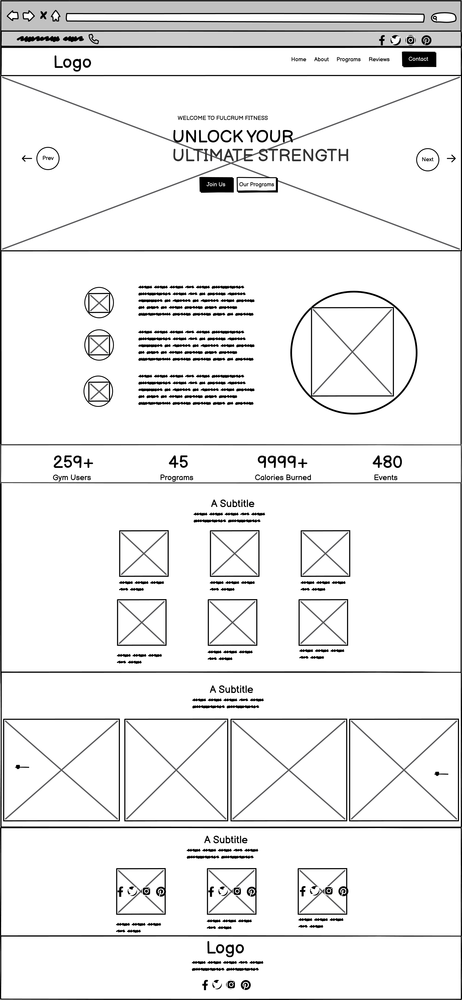
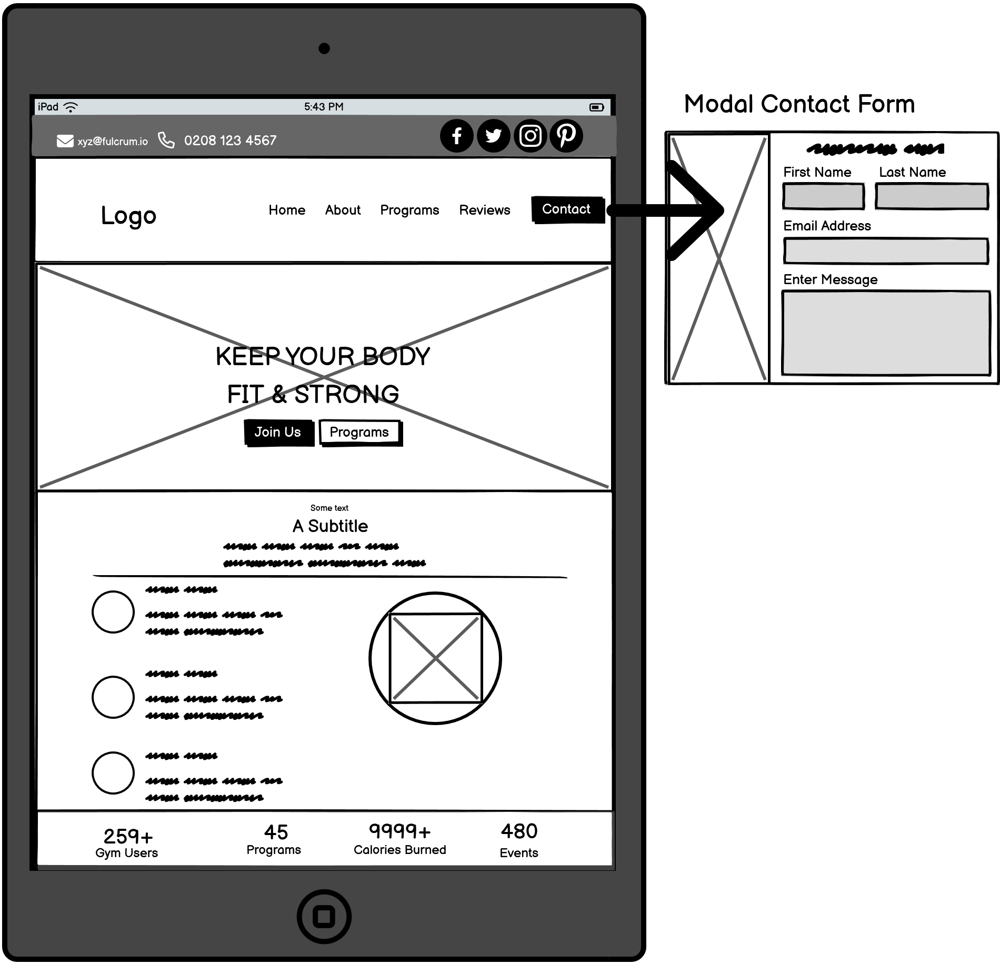
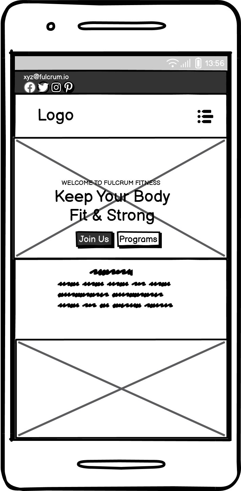
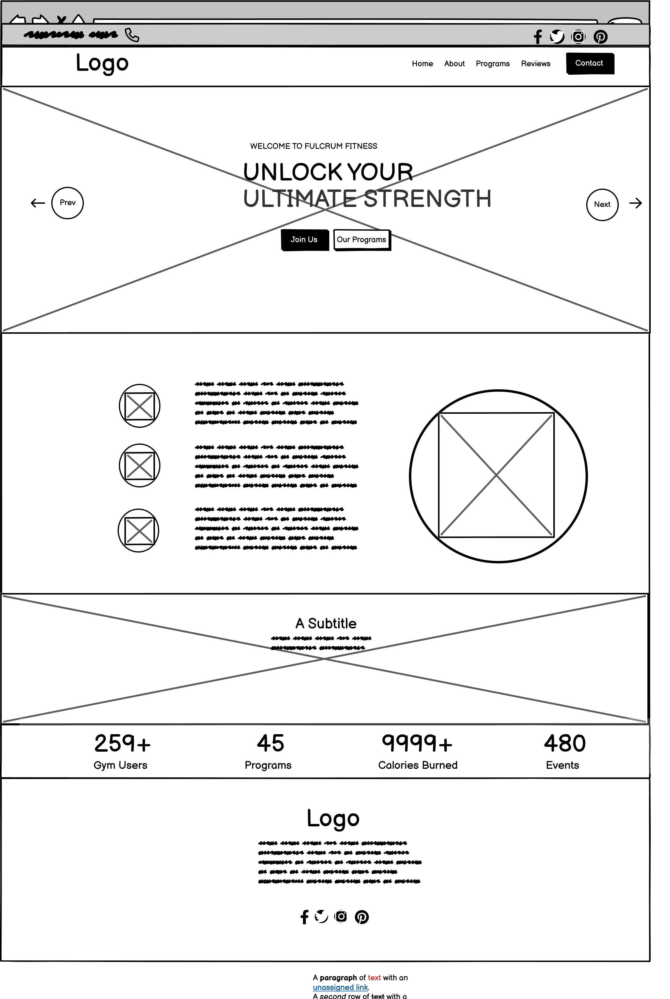
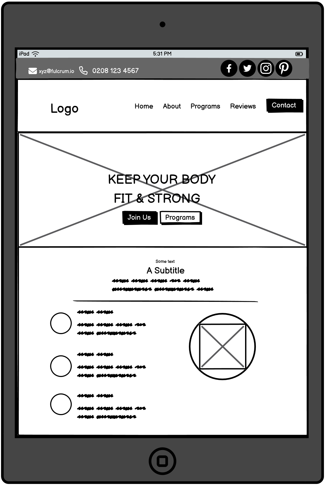
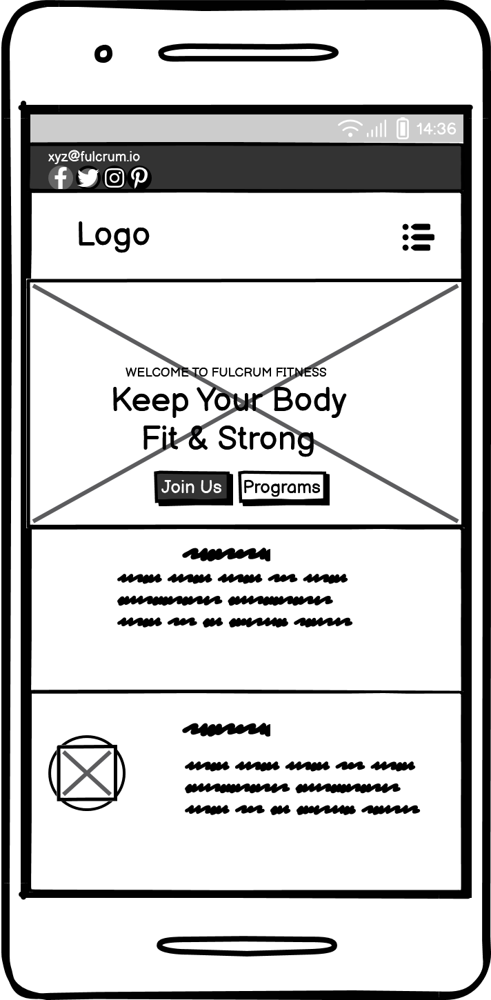
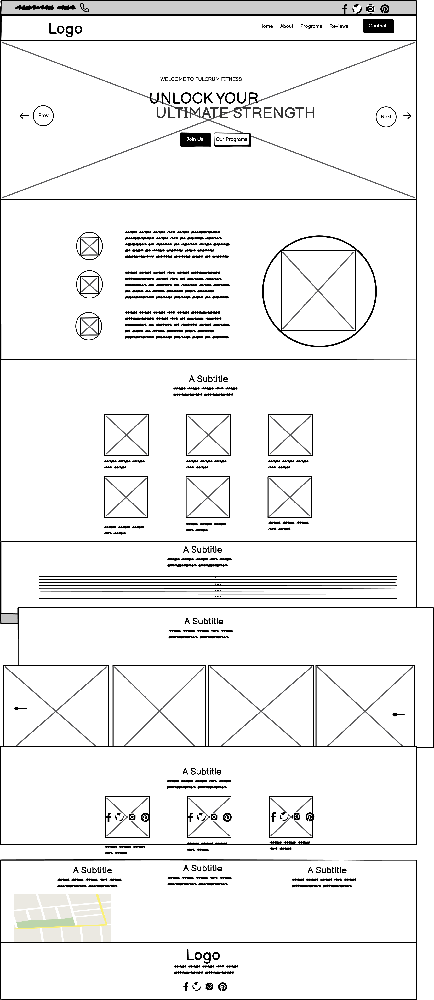
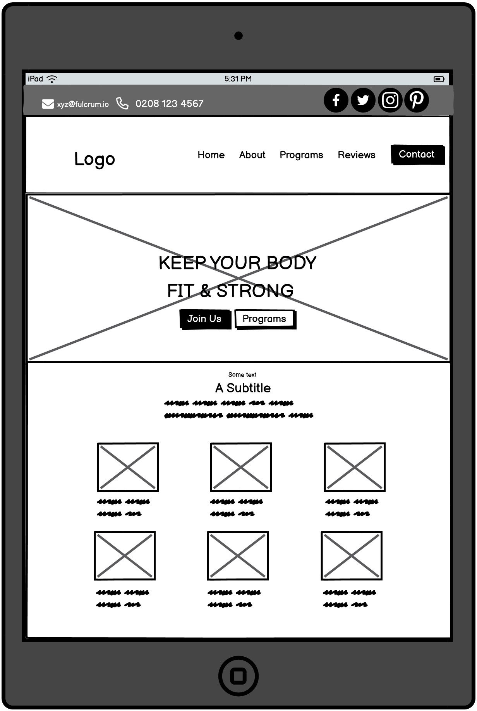
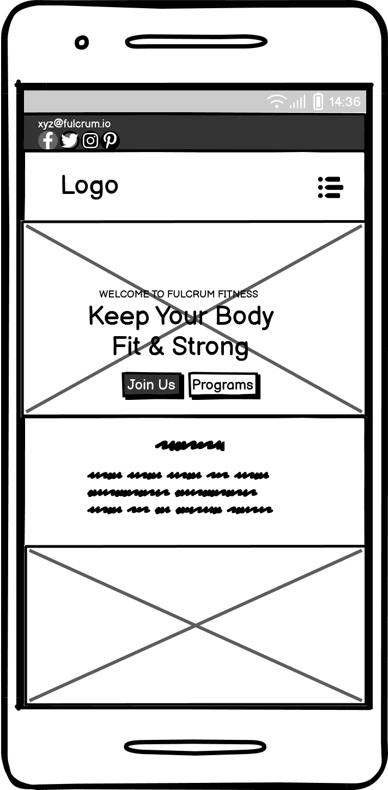

## Project Overview

Fulcrum Fitness Gym is an interactive and fully-functional web application designed to enhance the user experience for gym members. It aims to provide a seamless interface for managing memberships, booking classes, and accessing fitness resources. The application is developed using advanced web technologies to ensure responsiveness, usability, and accessibility.

[View the live website here ](https://jboates01.github.io/fulcrum-active-fitness-gym/)


## Rationale

The development of Fulcrum Active Gym addresses the growing need for digital solutions in the fitness industry. Our goal is to create a website that not only meets the operational needs of gym management but also provides a user-friendly interface for members. This application is designed with the following objectives in mind:

- Streamlining the process of class bookings and membership management.
- Providing easy access to fitness resources and schedules.
- Enhancing user engagement through interactive features.

## Development Process

The development of Fulcrum Fitness Gym involved several stages. Below is a detailed explanation of each stage:

### 1. Project Planning and Rationale
The rationale for this application addresses the need for efficient gym management and enhanced member engagement. Gym owners face challenges like membership management, class scheduling, and maintaining user engagement, which traditional methods often fail to solve. This project integrates various aspects into one platform, providing information on gym facilities, trainer social media profiles, member testimonials, special events, and an interactive contact form. By automating tasks, streamlining communication, and offering personalised experiences, the application enhances management efficiency and member satisfaction. This comprehensive approach improves operations and fosters a stronger sense of community and loyalty among gym members.

### 2. Custom HTML and CSS
The application was developed using custom HTML and CSS code, ensuring compliance with official validation standards:
- **HTML Validation:** The HTML code passed through the W3C validator with no issues.
- **CSS Validation:** The CSS code passed through the official Jigsaw validator with no issues, including advanced techniques such as CSS media queries for responsiveness.

## User Experience (UX)

### User Stories

#### First Time Visitor Goals
- **As a First Time Visitor, I want to easily understand the main purpose of the site and learn more about the gym.**
  - Upon entering the site, users are greeted with a clean and easily readable interface that clearly conveys the purpose of the gym.
  - The homepage features an engaging image that gives an immediate sense of the gym's atmosphere and offerings.
- **As a First Time Visitor, I want to be able to easily navigate throughout the site to find content.**
  - The site is fully responsive, ensuring optimal viewing on all devices.
  - The navigation bar is straightforward, allowing easy access to all sections of the site.
- **As a First Time Visitor, I want to look for the services the gym provides.**
  - Detailed pages outline the various services offered by the gym, making it easy for visitors to find the information they need.

#### Returning Visitor Goals
- **As a Returning Visitor, I want to find information about the different services the gym provides.**
  - The services page is updated regularly, providing comprehensive details about all available classes and facilities.
- **As a Returning Visitor, I want to find the best way to get in contact with the gym.**


### 3. Screenshots and User Stories
Screenshots of the finished project are included to illustrate the user interface and functionality, aligning with relevant user stories. These visuals provide a clear representation of how the application meets user needs.

### 4. Manual Testing Procedures
Comprehensive manual testing procedures were designed and implemented to assess the application's functionality, usability, and responsiveness. Testing scenarios covered various user interactions to ensure a seamless experience across different devices and browsers.

### 5. Testing Documentation
The results of the testing procedures are documented in this README file, detailing the methods used and the outcomes. This documentation provides transparency and serves as a reference for future improvements.

### 6. Development Lifecycle
The README file includes a detailed account of the development lifecycle procedures. This documentation covers all stages from initial planning to final deployment, highlighting key milestones and decisions.

### 7. Commit Messages
The development and testing process is clearly evident through detailed commit messages. Each commit message provides a rationale for the changes made, ensuring that the project history is well-documented and justified.

### 8. User Stories and Target Audience
The application was developed with a clear understanding of the target audience's needs. User stories were created to guide the development process, ensuring that the application addresses specific requirements and enhances user satisfaction.

### 9. Advanced Techniques
The application incorporates advanced web development techniques, such as CSS media queries, to ensure that it is fully responsive and provides a consistent user experience across different devices.

## Conclusion

Fulcrum Active Gym is a robust web application developed with a focus on functionality, usability, and user satisfaction. By adhering to industry standards and employing advanced techniques, we have created a platform that meets the needs of both gym management and members. We invite you to explore the application and provide feedback to help us continue improving.

Thank you for your interest in Fulcrum Active Gym.


This project aims to provide an engaging, informative, and accessible online experience for gym members and potential clients. It features a responsive design, interactive elements, and a wealth of resources about a fictitious gym club - Fulcrum Fitness Club.

Description

Fulcrum Fitness website is designed to promote the gym's programs and facilities, engage with members, and attract new visitors. The site includes features like class schedules, trainer social media follow links, member testimonials, and detailed information about special events and challenges.

# Project Goals for the Fulcrum Fitness Website

The Fulcrum Fitness Website is designed with the following key objectives in mind:

## 1. Create a User-Friendly Interface
- **Objective:** Design an intuitive and easy-to-navigate website that allows visitors to find information quickly.
- **Details:** The interface should be simple yet functional, catering to users of all ages and technical skills.

## 2. Develop Responsive Web Pages
- **Objective:** Ensure that the website is fully responsive on all devices.
- **Details:** Utilise flexible layouts, images, and CSS or media queries to accommodate various screen sizes and orientations.

## 3. Provide Comprehensive Fitness Information
- **Objective:** Offer detailed information about fitness programs, including schedules and session descriptions.
- **Details:** Information should be easy to update to reflect any changes.

## 4. Incorporate a Contact Us Section
- **Objective:** Implement a "Contact Us" area with an inquiry form and essential contact details.
- **Details:** Include email, phone number, and physical location information.

## 5. Include a Map Integration
- **Objective:** Embed a map to show the location of the fitness centre.
- **Details:** The map should be clear and easy to read, allowing users to zoom and view directions.

## 6. Ensure High Performance and Security
- **Objective:** The website should load quickly and operate smoothly.
- **Details:** The code should be clean to avoid link errors form errors.

## 7. Promote Engagement and Interaction
- **Objective:** Encourage interaction through social media links and beautiful and engaging imagery to make the club appealing for new membership signups.
- **Details:** Include health tips and possibly special events that features health and wellness themes to keep visitors engaged.

By meeting these goals, Fulcrum Fitness aims to increase client engagement and satisfaction, creating a comprehensive and effective online presence.

# Customer Goals for the Fulcrum Fitness Website

The design and functionality of the Fulcrum Fitness Website are geared towards meeting the following customer goals:

## 1. Easy Navigation and Accessibility
- **Goal:** Customers should be able to easily navigate the website and find the information they need without hassle.
- **Details:** Key information is accessible from the homepage, with clear links to all sections.

## 2. Access Detailed Training Information
- **Goal:** Provide customers with comprehensive details about training schedules, availability, and trainers.
- **Details:** Each training program and session is described in detail, including the time, duration, and trainer profiles.

## 3. Seamless Contact and Interaction
- **Goal:** Enable customers to contact Fulcrum Fitness effortlessly to book sessions or ask questions.
- **Details:** A user-friendly contact form along with direct contact details and an interactive map to locate the fitness centre.

## 4. Responsive Design for All Devices
- **Goal:** Ensure every customer can access the website from any device, whether desktop, tablet, or smartphone.
- **Details:** The website uses responsive design techniques to provide a consistent experience across all devices.

## 5. Find Us Easily
- **Goal:** Help new clients locate the fitness centre easily through detailed maps and directions.
- **Details:** An embedded Google Maps interface allows users to get directions from their location to the centre.

## 6. Learn and Engage
- **Goal:** Offer educational content and updates through a blog and social media that encourage health and fitness education.
- **Details:** Regular posts about fitness tips, health news, and community events to keep customers engaged and informed.

## 7. Stay Updated
- **Goal:** Provide a way for customers to receive updates about new sessions, offers, or changes in schedules.
- **Details:** Integration of a newsletter signup form where customers can subscribe to receive updates directly in their inbox.

By focusing on these goals, the Fulcrum Fitness Website aims to enhance the overall customer experience, making it easier and more enjoyable for clients to engage with their fitness goals.

# Project Requirements for the Fulcrum Fitness Website

The following are the detailed project requirements and specific functionalities that the development team aimed to implement:

## 1. Website Structure and Content
- **Requirement:** The website must consist of at least three separate pages or page areas if using a single scrolling page.
- **Details:** 
  - Home page with an overview of the fitness centre
  - Training Schedule page detailing upcoming sessions
  - Contact Us page with a form and map integration

## 2. Responsive Design
- **Requirement:** The website must be responsive, displaying correctly on desktops, tablets, and mobile devices.
- **Details:** Use Bootstrap grids, CSS and CSS media queries to ensure that layout, text, and images adjust smoothly across different screen resolutions.

## 3. User Interaction
- **Requirement:** Interactive elements such as forms, buttons, and links must be functional and easy to use.
- **Details:** 
  - A simple contact form to capture user inquiries
  - Clickable links to social media pages
  - Buttons for submitting forms.

## 4. Map Integration
- **Requirement:** Incorporate an interactive map to show the location of the fitness centre.
- **Details:** Use Google Maps API or similar to embed a map that allows users to zoom and find directions.

## 8. Accessibility
- **Requirement:** The website must be accessible according to WCAG 2.1 guidelines.
- **Details:** 
  - Provide text alternatives for non-text content
  - Ensure all functionality is available from a keyboard
  - Use sufficient contrast ratios for text against background

By implementing these requirements, the Fulcrum Fitness Website will not only meet the initial project scope but also provide a robust platform for future enhancements and user engagement.

# User Stories for the Fulcrum Fitness Website

User stories help define the functionality of the website from the perspective of different users. Below are the key user stories that have guided the development of the Fulcrum Fitness Website:

## 1. As a new visitor, I want to easily navigate the website, so that I can find the information I need without frustration.

## 2. As a potential client, I want to view the training schedule, so I can see if there are sessions that fit my availability.

## 3. As a returning visitor, I want the ability to contact the gym directly through the website, so that I can ask specific questions or arrange a visit.

## 4. As a user with disabilities, I want to be able to use the website fully, so that I can access all areas just like any other user.

## 5. As a busy user, I want to access the website from any device, so that I can check information on-the-go whether on my phone, tablet, or desktop.

## 6. As a new customer, I want to easily find directions to the gym, so that I can visit for the first time without getting lost.

## 7. As an interested client, I want to fill out a contact form to register for a training session, so that I can secure my spot without needing to call.

## 8. As a tech-savvy user, I want to interact with the website’s social media links, so that I can follow them and stay updated on events and offers.

Each user story is implemented with the goal of enhancing user satisfaction and ensuring that the website serves the needs of all visitors effectively.

# Design and Architecture of the Fulcrum Fitness Website

The design and architecture of the Fulcrum Fitness Website are crafted to provide a user-friendly, efficient, and visually appealing experience. Below are detailed insights into the layout, design choices, technologies used, and considerations for responsive design.

## Website Architecture

### Layout
The website architecture is designed with simplicity and scalability in mind, employing a modular approach that includes:
- **Home Page**: Introduces the fitness centre and provides quick navigation to other sections.
- **Training Schedule**: Lists all available training sessions for different types of classes.
- **Contact Us**: Features a modal form for inquiries.
- **Programs**: Features pictures of different training sessions, has a training schedule, contact details and an embedded map to where customers can find the gym.

### Diagrams and Sketches
These visual representations helped in planning the site layout and the interaction between different components.

Here are the wireframes for the Fulcrum Fitness Gym Website Project

## Project Wireframes

### Homepage Wireframes

Here are the wireframes for the homepage layout:





### About Us Page Wireframes
Below is the wireframe depicting the about page design:





#### Programs Page Wireframes
Below is the wireframe depicting the programs page design:





## Design Choices

### Choosing a Static Site
- **Performance and Simplicity**: Static sites load faster and are less complex to deploy and maintain compared to dynamic sites.
- **Security**: Fewer security risks as there are no databases or dynamic server-side processing.
- **Cost-Effectiveness**: Hosting for static websites is generally cheaper, and sometimes free, on platforms like GitHub Pages.

### Layout Decisions
- **Navigation**: Easy-to-use, fixed top navigation bar that remains accessible as users scroll.
- **Typography**: Clear and readable fonts, with a professional look that aligns with the fitness centre's branding.
- **Color Scheme**: Motivating and energetic colours that enhance the user experience and focus on fitness and health.

## Technologies Used
- **HTML5**: For structuring the content and creating a semantic layout.
- **CSS3**: For styling, animations, and responsive design features.
- **JavaScript (optional)**: For interactive elements like modal windows, form validation, and handling interactive maps.

## Responsive Design Considerations

- **Flexible Grid Layout**: Ensures that the site's layout adjusts smoothly across devices of varying screen sizes.
- **Media Queries**: Used extensively to tailor the site's design to different devices, improving usability and readability.
- **Images and Icons**: Employ scalable vector graphics (SVGs) and ensure all images are responsive to fit their containers without distorting the page layout.
- **Testing**: Regular testing on multiple devices to ensure compatibility and responsiveness.

By adhering to these design principles, the Fulcrum Fitness Website aims to deliver a superior user experience, optimized for both functionality and aesthetic appeal across all devices.

## Technologies Used

1. **HTML5**
2. **CSS3**
3. **JavaScript**
4. **JQuery**
5. **Bootstrap**: Used for responsive, mobile-first design. Licensed under MIT ([license](https://github.com/twbs/bootstrap/blob/main/LICENSE))
6. **Owl Carousel**: Implemented for creating interactive carousels for testimonials and gallery sections. Licensed under: [SEE LICENSE](https://github.com/OwlCarousel2/OwlCarousel2/blob/master/LICENSE)
7. **Boxicons**: Icons used throughout the website for intuitive and aesthetically pleasing UI design.
8. **W3Schools & Code Institute**: References for coding techniques and best practices.
9. **Canva Pro & Pexels**: High-quality images used to enhance visual appeal and user engagement.

## Features

- Responsive Layout
- Interactive Carousels
- Modal Contact Form
- New Fitness Routines Section
- Real-time Class Schedules
- Accessible Design

## Setup

To get a local copy up and running, follow these simple steps:

1. Clone the repo

https://jboates01.github.io/fulcrum-active-fitness-gym/#

2. Open `index.html` in your browser to view the project.


## Code Example

Here's a snippet from our Owl Carousel implementation:

### HTML

```html
<div class="owl-carousel owl-theme hero-slider">
    <div class="slide slide1">
        <div class="container">
            <div class="row">
                <div class="col-12 text-center text-white">
                    <h6 class="text-white text-uppercase">Welcome to Fulcrum Active</h6>
                    <h1 class="display-3 my-4">Keep your body <br /><span>fit & Strong</span></h1>
                    <a href="#" class="btn btn-brand">Join Us</a>
                    <a href="#" class="btn btn-outline-light ms-3">Our Programs</a>
                </div>
            </div>
        </div>
    </div>
</div>

## JavaScript

$('.owl-carousel').owlCarousel({
    loop:true,
    margin:10,
    nav:true,
    responsive:{
        0:{
            items:1
        },
        600:{
            items:2
        },
        1000:{
            items:3
        }
    }
})


### Credits

- **Design Inspiration**: W3Schools, Code Institute, ARCTutorials (YouTube Channel)
- **Icons**: Boxicons
- **Slides**: Owl Carousel


# Picture Credits

Images used in the homepage sliders are credited to the following photographers:

- **MRGIG_PHOTOGRAPHY**
  - Contributions: Man image used throughout the homepage slider.
  - Source: [MRGIG_PHOTOGRAPHY's Portfolio via Canva Pro]

- **Gilaxia**
  - Contributions: Lady image featured in the homepage slider.
  - Source: [Gilaxia's Portfolio via Canva Pro]

  **Training Programs, icons and images used in the special events section **
  - Contributions: All activity images. Source: [Avanti-photos via Canva Pro]

We appreciate the talent and work of the photographers that enhance the visual appeal of our website.


License

This project is licensed under the MIT License - see the "Technologies Used Section" for LICENCE details.


# Deployment of the Fulcrum Fitness Website

The Fulcrum Fitness Website was deployed to ensure it is accessible and runs efficiently on all devices. Below is an overview of the deployment process and the technologies used.

## Deployment Process

### 1. Code Preparation and Optimisation
- The complete, tested code was pushed to a GitHub repository, ensuring all assets such as images, Bootstrap codes, Boxicon codes, Owl carousel codes, JQuery and JavaScript files were properly linked.
- HTML, CSS, and JavaScript files minified versions were taken from bootstrap and github to reduce load times and improve the site’s responsiveness.

### 2. Repository Setup and Integration
- The GitHub repository was linked to Gitpod to utilise its continuous deployment features.
- Any updates made and pushed to the GitHub repository are automatically deployed to the live website through Gitpod’s continuous deployment pipeline.

### 4. HTTPS Configuration
- HTTPS was automatically set up through Github, using Let’s Encrypt to provide a secure, encrypted connection for all users.
- This configuration ensures that all data transmitted between the website and its users is secure.

## Post-Deployment Activities
- **Monitoring**: Lighthouse’s monitoring tools were employed to ensure high uptime and address any availability issues promptly.
- **Updates**: Regular updates were made to the site’s content and structure as needed, pushed through GitHub.
- **Analytics**: W3Schools CSS and HTM Validators were used to test the site.

This deployment strategy ensures that the Fulcrum Fitness Website remains robust, responsive, and secure, providing a seamless experience to its users.

# Bugs Fixed in the Fulcrum Fitness Website

During the development and ongoing maintenance of the Fulcrum Fitness Website, several key issues were identified and resolved to enhance performance, usability, and security. Below is a list of some significant bugs that were fixed, along with the solutions implemented.

## List of Bugs and Fixes

### 1. Responsive Design Issues
- **Problem:** Certain layout elements were not displaying correctly on mobile devices.
- **Fix:** Adjusted Bootstrap CSS Grids and tested various devices to ensure a consistent and responsive layout across all screen sizes.

### 2. Navigation Link Issues
- **Problem:** Some navigation links for the social icons were not directing to their respective pages.
- **Fix:** Corrected the href attributes in the navigation bar and ensured that all internal links were properly anchored to the respective sections.

### 3. Map Display Errors
- **Problem:** The embedded Google Map was not loading correctly on the Contact Us page due to an incorrect API key configuration.
- **Fix:** Updated the Google Maps API key and adjusted the API settings to ensure the map loaded correctly and remained interactive.

### 4. Broken image links on GitHub
- **Problem:** While the pages loaded correctly on Gitpod, it lost all images and page structure when pushed to GitHub.
- **Fix:** Researched the problem and found some answers from stackoverflow.com which indicated that GitHub did not like image file paths like (../images/image.jpg) and that removing the first / will resolve the problem. Corrected the paths on all images i.e (images/images.jpg) on all pages and tested to ensure that all  image links were properly working on all pages.


Contact

For more information, please contact me at jake.boateng@gmail.com.


