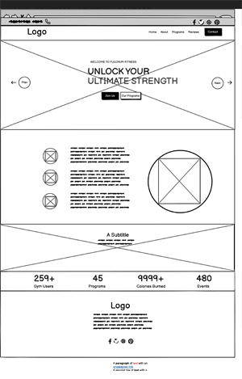

## Welcome to Fulcrum Fitness Gym Website Project

Fulcrum Fitness Gym is an interactive and fully-functional web application designed to enhance the user experience for gym members. It aims to provide a seamless interface for managing memberships, booking classes, and accessing fitness resources. The application is developed using advanced web technologies to ensure responsiveness, usability, and accessibility.

[View the live website here ](https://jboates01.github.io/fulcrum-active-fitness-gym/)

## Rationale

### Overview of the Project 

The Fulcrum Active Gym website is designed to offer a comprehensive digital solution for gym members to access essential information about the gym. The primary goal of this project is to create a user-friendly, interactive platform where members can learn about the gym facilities, activities, trainers, and schedules, and get in touch through a contact form. By leveraging modern web technologies, the website aims to enhance the overall fitness experience for users of all ages and fitness levels.

### Inspiration and Purpose

The motivation behind creating the Fulcrum Active Gym website stems from the increasing demand for efficient, digital solutions in the fitness industry. With more people seeking convenient ways to manage their fitness routines, there was a clear need for a platform that combines ease of use with robust functionality. This project aims to fill that niche by providing an engaging, interactive experience that meets the diverse needs of gym members.

The inspiration for this project comes from the desire to improve the traditional gym experience by integrating digital tools that offer greater flexibility and accessibility. By addressing common pain points such as accessing gym schedules and trainer information, the Fulcrum Active Gym website seeks to enhance member satisfaction and operational efficiency.

### Project Background 

The fitness industry has seen a significant shift towards digitalization, with many gyms adopting online platforms to manage their operations and engage with members. However, existing solutions often lack the intuitive interfaces and comprehensive features needed to meet the evolving demands of users. Recognising this gap, the Fulcrum Active Gym website was conceived to offer a fresh take on gym management by utilising advanced web technologies to create a responsive, dynamic user experience.

The development of this website focuses on ensuring seamless navigation and user interaction. While the initial scope of the project seemed straightforward, several challenges arose that required innovative solutions, ultimately leading to a more robust and user-friendly platform.

### Scope and Limitations of the Project

The scope of the project includes the development of a web-based platform with the following features:
- Information on gym facilities
- Details on gym activities
- Information on trainers with their social media links
- Schedules for gym activities
- A modal interactive contact form
- An interactive location map

Known limitations include:
- Dependence on external APIs for trainer and schedule data, which can affect availability and accuracy.
- Potential browser compatibility issues, despite efforts to ensure cross-browser functionality.

### Identified Challenges

The primary problem that the Fulcrum Active Gym website aims to address is the inefficiency of traditional gym management methods and the lack of engaging, user-friendly digital solutions. Many existing platforms are either too complex for everyday users or lack the features needed to streamline gym operations effectively. Additionally, there is a need for a platform that offers a consistent, high-quality experience across different devices without requiring extensive setup or downloads.

### Strategic Solution

The Fulcrum Active Gym website offers a comprehensive solution with the following key features:
- **Gym Facility Information:** Detailed information about the gym facilities, allowing members to understand what the gym offers.
- **Activity Information:** Clear descriptions of various gym activities, helping members choose the right programs for their fitness goals.
- **Trainer Information:** Profiles of trainers with their social media links, providing members with insights into their expertise and personality.
- **Schedules:** Up-to-date schedules for all gym activities, ensuring members can plan their visits effectively.
- **Interactive Contact Form:** A modal contact form for easy communication, allowing members to get in touch with the gym conveniently.
- **Interactive Location Map:** An interactive map to help members and potential visitors easily locate the gym and get directions.

### Key Benefits

The Fulcrum Active Gym website offers several advantages over traditional gym management methods and existing digital platforms:
- **Enhanced User Experience:** The intuitive interface and responsive design ensure a seamless experience across all devices.
- **Operational Efficiency:** Providing essential information online reduces the need for administrative support.
- **Member Engagement:** Detailed profiles and schedules keep members informed and engaged.
- **Accessibility:** Designed to be accessible to all users, including those with disabilities, ensuring inclusivity.

### Future Enhancements

Ideas for future enhancements to the Fulcrum Active Gym website include:
- **Membership Management:** Enabling users to manage their memberships online, including sign-ups, renewals, and cancellations.
- **Class Scheduling and Booking:** Allowing members to book classes directly through the website.
- **Expanded Fitness Resources:** Incorporating more diverse and extensive resources to cater to various fitness needs and preferences.
- **Multilingual Support:** Allowing the website to be used in multiple languages to serve a broader audience.
- **Advanced Analytics:** Providing detailed analytics and insights for gym management to optimise operations and improve member satisfaction.
- **Integration with Wearables:** Allowing users to sync their fitness data from wearable devices for a more comprehensive tracking experience.
- **Community Features:** Adding forums and social features to foster a sense of community among members.

### Conclusion

The Fulcrum Active Gym website is an innovative digital platform designed to provide essential information about the gym and enhance member engagement. By addressing the need for efficient, user-friendly solutions in the fitness industry, the website stands out with its comprehensive features, intuitive design, and focus on accessibility. The project not only offers immediate benefits to users and gym management but also has the potential for future enhancements that will keep it relevant and valuable.

By incorporating modern web technologies and focusing on user-centric design, the Fulcrum Active Gym website aims to revolutionize the traditional gym experience, making fitness management more accessible, efficient, and engaging for everyone.

## Development Process

The development of Fulcrum Fitness Gym involved several stages. Below is a detailed explanation of each stage:

### 1. Project Planning and Rationale
The rationale for this application addresses the need for efficient gym management and enhanced member engagement. Gym owners face challenges like membership management, class scheduling, and maintaining user engagement, which traditional methods often fail to solve. This project integrates various aspects into one platform, providing information on gym facilities, trainer social media profiles, member testimonials, special events, and an interactive contact form. By automating tasks, streamlining communication, and offering personalised experiences, the application enhances management efficiency and member satisfaction. This comprehensive approach improves operations and fosters a stronger sense of community and loyalty among gym members.

### 2. Custom HTML and CSS
The application was developed using custom HTML and CSS code, ensuring compliance with official validation standards:
- **HTML Validation:** The HTML code passed through the W3C validator with no issues.
- **CSS Validation:** The CSS code passed through the official Jigsaw validator with no issues, including advanced techniques such as CSS media queries for responsiveness.

## User Experience (UX)

### User Stories

#### First Time Visitor Goals
- **As a First Time Visitor, I want to easily understand the main purpose of the site and learn more about the gym.**
  - Upon entering the site, users are greeted with a clean and easily readable interface that clearly conveys the purpose of the gym.
  - The homepage features an engaging image that gives an immediate sense of the gym's atmosphere and offerings.
- **As a First Time Visitor, I want to be able to easily navigate throughout the site to find content.**
  - The site is fully responsive, ensuring optimal viewing on all devices.
  - The navigation bar is straightforward, allowing easy access to all sections of the site.
- **As a First Time Visitor, I want to look for the services the gym provides.**
  - Detailed pages outline the various services offered by the gym, making it easy for visitors to find the information they need.

#### Returning Visitor Goals
- **As a Returning Visitor, I want to find information about the different services the gym provides.**
  - The services page is updated regularly, providing comprehensive details about all available classes and facilities.
- **As a Returning Visitor, I want to find the best way to get in contact with the gym.**

## Design Choices

### Choosing a Static Site
- **Performance and Simplicity**: Static sites load faster and are less complex to deploy and maintain compared to dynamic sites.
- **Security**: Fewer security risks as there are no databases or dynamic server-side processing.
- **Cost-Effectiveness**: Hosting for static websites is generally cheaper, and sometimes free, on platforms like GitHub Pages.

### Layout Decisions
- **Navigation**: Easy-to-use, fixed top navigation bar that remains accessible as users scroll.
- **Typography**: Clear and readable fonts, with a professional look that aligns with the fitness centre's branding.
- **Color Scheme**: Motivating and energetic colours that enhance the user experience and focus on fitness and health.

### Colour Scheme
- The main color scheme for the site includes:  
  - `#092032` (rgb(10, 38, 71))
  - `#516171` (rgb(20, 66, 114))
  - `#f2dd66` (rgb(32, 82, 149))
  - `#dc2543` (rgb(44, 116, 179))
  - `#747ba9` (rgb(44, 116, 179))

### Typography
- The primary font used throughout the website is 'Barlow', with 'Sans Serif' as the fallback font.

### Imagery
- Imagery plays a crucial role in the website, with high-quality images used on the homepage and service pages to illustrate the gym's facilities and activities.

### Wireframes
- Wireframes were created to outline the structure and layout of the website.

Here are the wireframes for the homepage layout:

**Desktop**

 

**Tablet**

 

**Mobile**

 

## 1. Website Structure and Content
- **Requirement:** The website must consist of at least three separate pages or page areas if using a single scrolling page.
- **Details:** 
  - Home page with an overview of the fitness centre
  - Training Schedule page detailing upcoming sessions
  - Contact Us page with a form and map integration

## 2. Responsive Design
- **Requirement:** The website must be responsive, displaying correctly on desktops, tablets, and mobile devices.
- **Details:** Use Bootstrap grids, CSS and CSS media queries to ensure that layout, text, and images adjust smoothly across different screen resolutions.

## 3. User Interaction
- **Requirement:** Interactive elements such as forms, buttons, and links must be functional and easy to use.
- **Details:** 
  - A simple contact form to capture user inquiries
  - Clickable links to social media pages
  - Buttons for submitting forms.

## 4. Map Integration
- **Requirement:** Incorporate an interactive map to show the location of the fitness centre.
- **Details:** Use Google Maps API or similar to embed a map that allows users to zoom and find directions.

## 8. Accessibility
- **Requirement:** The website must be accessible according to WCAG 2.1 guidelines.
- **Details:** 
  - Provide text alternatives for non-text content
  - Ensure all functionality is available from a keyboard
  - Use sufficient contrast ratios for text against background

By implementing these requirements, the Fulcrum Fitness Website will not only meet the initial project scope but also provide a robust platform for future enhancements and user engagement.

## Responsive Design Considerations

- **Flexible Grid Layout**: Ensures that the site's layout adjusts smoothly across devices of varying screen sizes.
- **Media Queries**: Used extensively to tailor the site's design to different devices, improving usability and readability.
- **Images and Icons**: Employ scalable vector graphics (SVGs) and ensure all images are responsive to fit their containers without distorting the page layout.
- **Testing**: Regular testing on multiple devices to ensure compatibility and responsiveness.

By adhering to these design principles, the Fulcrum Fitness Website aims to deliver a superior user experience, optimized for both functionality and aesthetic appeal across all devices.

## Technologies Used

1. **HTML5**
2. **CSS3**
3. **JavaScript**
4. **JQuery**
5. **Bootstrap**: Used for responsive, mobile-first design. Licensed under MIT ([license](https://github.com/twbs/bootstrap/blob/main/LICENSE)): Used for responsiveness and styling.
6. **Owl Carousel**: Implemented for creating interactive carousels for testimonials and gallery sections. Licensed under: [SEE LICENSE](https://github.com/OwlCarousel2/OwlCarousel2/blob/master/LICENSE)
7. **Boxicons**: Icons used throughout the website for intuitive and aesthetically pleasing UI design.
8. **W3Schools & Code Institute**: References for coding techniques and best practices.
9. **Canva Pro & Pexels**: High-quality images used to enhance visual appeal and user engagement.
10. **Google Fonts:** Used to import the 'Marvel' font into the style.css file.
11. **Git:** Used for version control, with commits and pushes to GitHub.
12. **GitHub:** Used to store the project's code.
13. **Photoshop:** Used to create wireframes and resize images for better display.

## Testing

### Automated Testing

- The W3C Markup Validator and W3C CSS Validator Services were used to validate every page of the project to ensure there were no syntax errors.
  - [W3C Markup Validator](https://www.validator.w3.org) - [Results](https://validator.w3.org/nu/?doc=https%3A%2F%2Fjboates01.github.io%2Ffulcrum-active-fitness-gym%2F)
  - [W3C CSS Validator](https://jigsaw.w3.org/css-validator/) - [Results](https://jigsaw.w3.org/css-validator/validator?uri=https%3A%2F%2Fjboates01.github.io%2Ffulcrum-active-fitness-gym%2F&profile=css3svg&usermedium=all&warning=1&vextwarning=&lang=en)
  -[Lighthouse Metrics](https://lighthouse-metrics.com/lighthouse/checks/cf51467a-36c8-4f15-8bf5-15036c709fca)

### Manual Testing
Please see [manual.md](https://jboates01.github.io/fulcrum-active-fitness-gym/manual.md) for detailed manual testing information.

### Testing User Stories from User Experience (UX) Section

#### First Time Visitor Goals
- **As a First Time Visitor, I want to easily understand the main purpose of the site and learn more about the gym.**
  - The homepage clearly presents the gym's purpose with a welcoming image and easy-to-read content.
- **As a First Time Visitor, I want to be able to easily navigate throughout the site to find content.**
  - The site is fully responsive and easy to navigate.
- **As a First Time Visitor, I want to look for the services the gym provides.**
  - Service pages are easily accessible and provide detailed information.

#### Returning Visitor Goals
- **As a Returning Visitor, I want to find information about the different services the gym provides.**
  - The services page is detailed and easy to find.
- **As a Returning Visitor, I want to find the best way to get in contact with the gym.**
  - Contact information is readily available on the contact page and in the footer of every page.

### Further Testing
- The website was tested on various browsers: Google Chrome, Internet Explorer, Microsoft Edge, and Safari.
- The website was viewed on multiple devices: Desktop, Laptop, iPhone 7, iPhone 8, and iPhone X.
- Extensive testing ensured that all pages linked correctly.
- Friends and family members reviewed the site for bugs and user experience issues.

### Known Bugs
- No known bugs.

## Deployment

### GitHub Pages
- The project was deployed to GitHub Pages using the following steps:
  1. Log in to GitHub and locate the GitHub Repository.
  2. Go to the "Settings" tab in the repository.
  3. Scroll down to the "GitHub Pages" section.
  4. Under "Source," select "Master Branch."
  5. The page will refresh, and the website link will be provided in the "GitHub Pages" section.

### Forking the GitHub Repository
- To fork the repository:
  1. Log in to GitHub and locate the repository.
  2. Click the "Fork" button at the top of the repository.

### Making a Local Clone
- To make a local clone:
  1. Log in to GitHub and locate the repository.
  2. Click "Clone or download" and copy the URL.
  3. Open Git Bash and navigate to the desired directory.
  4. Type `git clone` followed by the copied URL.
  5. Press Enter to create the local clone.

## Credits

### Code
- **Bootstrap5:** Used for responsive design using the Bootstrap Grid System.
- **MDN Web Docs:** Used for pattern validation code, modified to fit project needs.

### Content
- All content was written by the developer.
- The colour scheme was selected from [Canva](https://canva.com/).

### Picture Credits

Images used in the homepage sliders are credited to the following photographers:

- **MRGIG_PHOTOGRAPHY**
  - Contributions: Man image used throughout the homepage slider.
  - Source: [MRGIG_PHOTOGRAPHY's Portfolio via Canva Pro]

- **Gilaxia**
  - Contributions: Lady image featured in the homepage slider.
  - Source: [Gilaxia's Portfolio via Canva Pro]

  **Training Programs, icons and images used in the special events section **
  - Contributions: All activity images. Source: [Avanti-photos via Canva Pro]

### Design inspiration

- **W3Schools**: Code Institute, ARCTutorials (YouTube Channel)
- **Icons**: Boxicons
- **Slides**: Owl Carousel

### License

This project is licensed under the MIT License - see the "Technologies Used Section" for LICENCE details.

# Bugs Fixed in the Fulcrum Fitness Website

During the development and ongoing maintenance of the Fulcrum Fitness Website, several key issues were identified and resolved to enhance performance, usability, and security. Below is a list of some significant bugs that were fixed, along with the solutions implemented.

## List of Bugs and Fixes

### 1. Responsive Design Issues
- **Problem:** Certain layout elements were not displaying correctly on mobile devices.
- **Fix:** Adjusted Bootstrap CSS Grids and tested various devices to ensure a consistent and responsive layout across all screen sizes.

### 2. Navigation Link Issues
- **Problem:** Some navigation links for the social icons were not directing to their respective pages.
- **Fix:** Corrected the href attributes in the navigation bar and ensured that all internal links were properly anchored to the respective sections.

### 3. Map Display Errors
- **Problem:** The embedded Google Map was not loading correctly on the Contact Us page due to an incorrect API key configuration.
- **Fix:** Updated the Google Maps API key and adjusted the API settings to ensure the map loaded correctly and remained interactive.

### 4. Broken image links on GitHub
- **Problem:** While the pages loaded correctly on Gitpod, it lost all images and page structure when pushed to GitHub.
- **Fix:** Researched the problem and found some answers from stackoverflow.com which indicated that GitHub did not like image file paths like (../images/image.jpg) and that removing the first / will resolve the problem. Corrected the paths on all images i.e (images/images.jpg) on all pages and tested to ensure that all  image links were properly working on all pages.

### Acknowledgements
- **Google:** For use of maps on the contact page.
- **Boxicons:** For all icons on the site.

